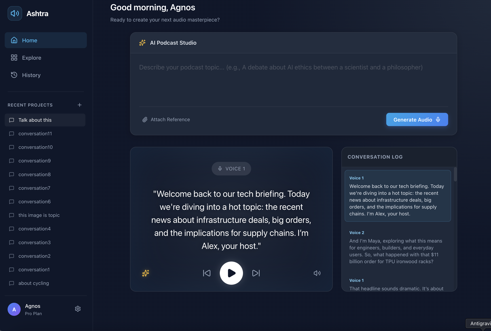

# Ashtra

**Turn your ideas into lifelike AI podcasts instantly.**

Ashtra is a powerful generative AI audio platform that transforms text prompts into multi-speaker podcasts with background ambience and dynamic visualizations.



## Features

-   **🎙️ AI Audio Generation**: Create realistic speech from text prompts.
-   **🗣️ Multi-Speaker Support**: Simulate conversations between distinctive voices (e.g., Skeptic vs. Optimist).
-   **🔊 Ambience Control**: Integrated white noise/ambience with adjustable volume controls.
-   **🎹 Visualizer Stage**: Dynamic audio visualization bar that reacts to playback.
-   **📂 File Attachment**: Upload PDFs or images as context for your generation.
-   **🎨 Premium UI**: A modern, glassmorphism-inspired interface with dark mode.

## Tech Stack

-   **Frontend**: React, Vite, Lucide React
-   **Backend**: Python, Flask (implied), AI Model Integration
-   **Styling**: Plain CSS (Variables, Flexbox/Grid, Animations)

## Getting Started

### Prerequisites

-   Node.js & npm
-   Python 3.8+

### Installation

1.  **Clone the repository**
    ```bash
    git clone https://github.com/akhilsonga/ASHTRAA.git
    cd ASHTRAA
    ```

2.  **Frontend Setup**
    ```bash
    cd Frontend
    npm install
    npm run dev
    ```

3.  **Backend Setup**
    ```bash
    cd Backend
    pip install -r requirements.txt  # If applicable, otherwise install dependencies manually
    python Restart_App.py
    ```

## Usage

1.  Open the frontend in your browser (usually `http://localhost:5173`).
2.  Enter a prompt in the studio card (e.g., *"A debate about AI between a scientist and a philosopher"*).
3.  (Optional) Attach a PDF or Image for context.
4.  Click **Generate Audio**.
5.  Use the playback controls to play, pause, or switch between conversation segments.
6.  Adjust the background ambience using the sparkle icon on the left.

## License

This project is licensed under the MIT License - see the [LICENSE](LICENSE) file for details.
